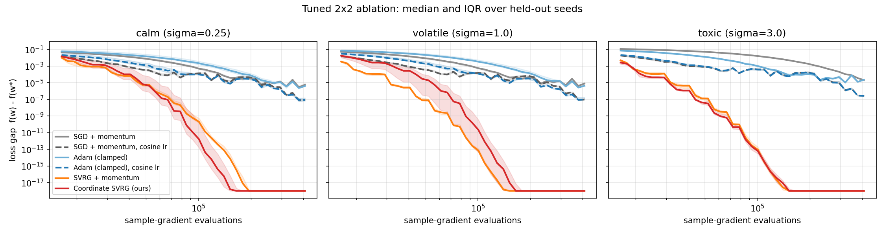
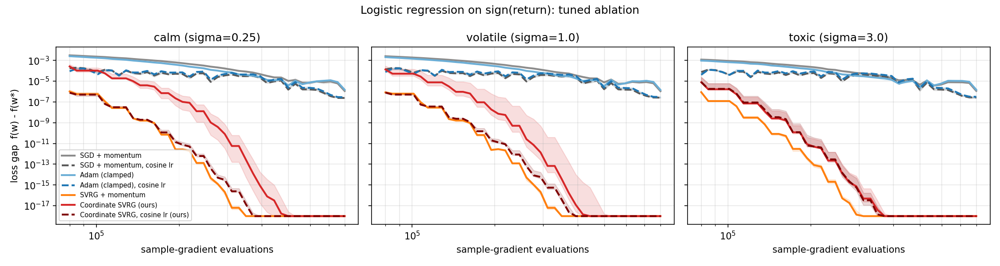
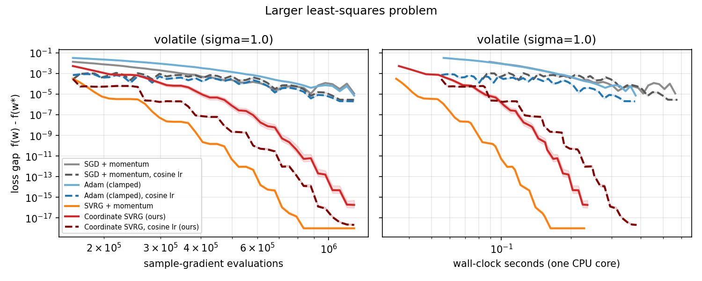
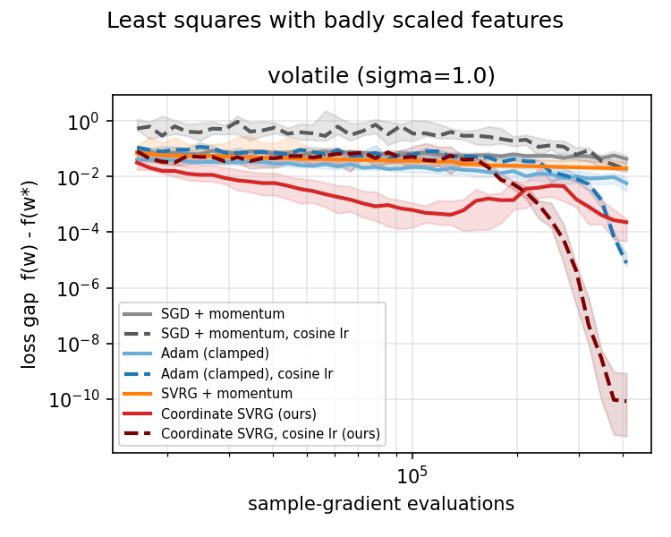
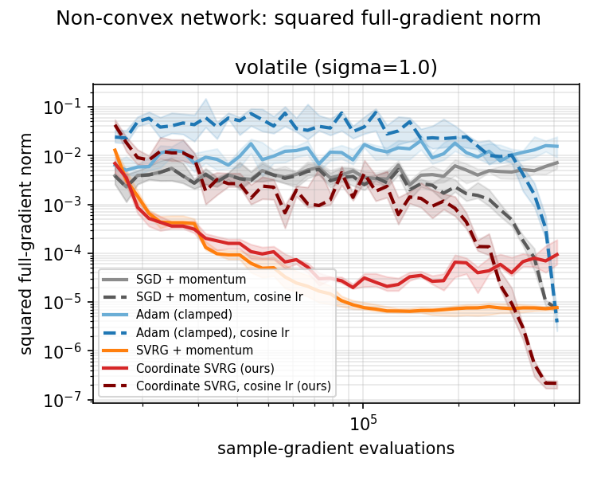
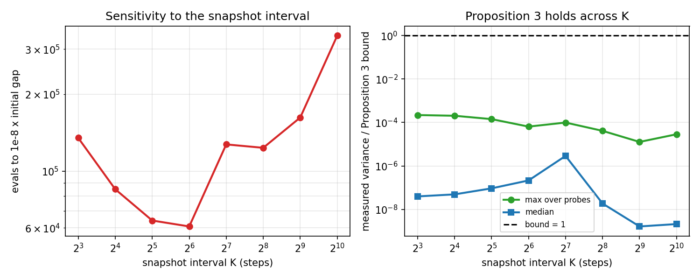
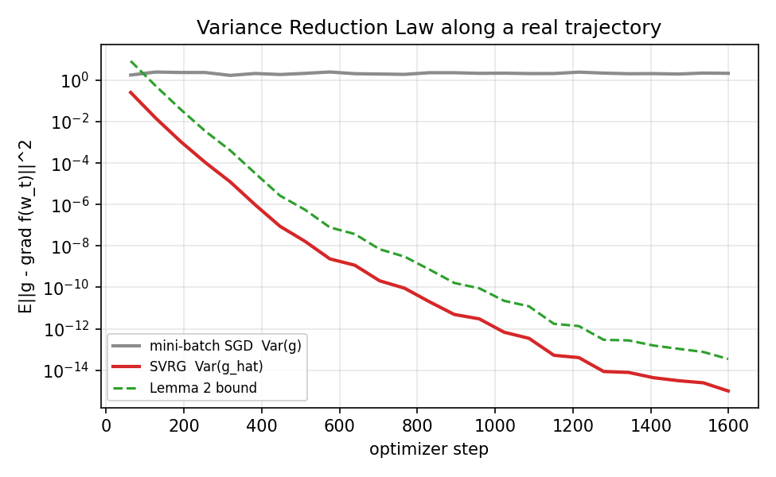
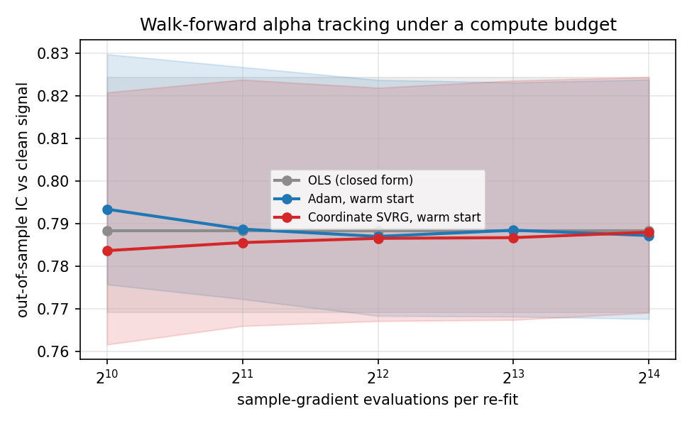

# Results

All numbers are produced by `python -m experiments.run_experiments` (about 15 minutes on one CPU core, NumPy only)
and stored in `results/experiments.json`. They use the NumPy reference implementation (`src/reference_numpy.py`),
which the PyTorch and JAX engines are tested against step for step.
**The PyTorch/JAX engines did not produce these numbers.** Figures are in `docs/figures/`.

Protocol: every method gets its own learning-rate sweep (log-spaced, 1e-5 to 10^-0.5) on *tuning* seeds, then is
scored on *disjoint* evaluation seeds. Budgets are counted in sample-gradient evaluations; SVRG is charged for its double
gradients and every full-gradient snapshot pass. Baselines include a cosine-decay learning-rate schedule, because a
constant-step baseline is a weak comparison for a method whose selling point is convergence at a constant step.
Cosine-decay runs are tied to the budget (the rate reaches zero exactly at the end), so their mid-run curves are not
comparable with constant-rate curves; compare final values. Seeds: Exp 1 and 6 use 2 tuning / 20 evaluation seeds, Exp 4
uses 1 / 12, Exp 5 uses 1 / 3, Exp 7 uses 2 / 8, Exp 3 uses 20, Exp 8 uses 8 fresh datasets, Exp 9 uses 2 / 6, Exp 10 uses 5 datasets.

*(Curves bottom out at 1e-18 only because the plot clamps there; the underlying gaps are about 1e-31, i.e. float64 round-off.)*

### Experiment 1: tuned ablation on least squares

Least squares, n=4096, d=32, batch 64, snapshot every 64 steps. Budget: 100 epochs of sample-gradient evaluations. Final loss gap `f(w) - f(w*)`, median [IQR] over held-out evaluation seeds; 'evals to target' = sample-gradient evaluations to reach 1e-08 x the initial gap.

**calm** (noise sigma = 0.25)

| Method | tuned lr | final gap, median [IQR] | evals to target |
|---|---|---|---|
| SGD + momentum | 1.78e-03 | 5.69e-06 [4.48e-06, 9.18e-06] | not reached |
| SGD + momentum, cosine lr | 4.22e-03 | 8.32e-08 [5.75e-08, 1.01e-07] | not reached |
| Adam (clamped) | 3.16e-04 | 4.04e-06 [3.20e-06, 5.33e-06] | not reached |
| Adam (clamped), cosine lr | 7.50e-04 | 8.79e-08 [7.15e-08, 1.30e-07] | not reached |
| SVRG + momentum | 3.16e-01 † | 3.24e-31 [2.06e-31, 5.56e-31] | 92,800 |
| Coordinate SVRG (ours) | 1.78e-03 | 3.39e-31 [2.19e-31, 5.65e-31] | 85,376 |
| Coordinate SVRG, cosine lr (ours) | 1.00e-02 | 3.63e-31 [2.26e-31, 5.70e-31] | 85,376 |

**volatile** (noise sigma = 1.0)

| Method | tuned lr | final gap, median [IQR] | evals to target |
|---|---|---|---|
| SGD + momentum | 1.78e-03 | 7.79e-06 [6.31e-06, 1.15e-05] | not reached |
| SGD + momentum, cosine lr | 4.22e-03 | 9.69e-08 [8.88e-08, 1.17e-07] | not reached |
| Adam (clamped) | 3.16e-04 | 4.22e-06 [3.44e-06, 5.17e-06] | not reached |
| Adam (clamped), cosine lr | 7.50e-04 | 9.72e-08 [8.81e-08, 1.40e-07] | not reached |
| SVRG + momentum | 1.33e-01 | 3.87e-31 [2.64e-31, 5.51e-31] | 72,448 |
| Coordinate SVRG (ours) | 1.78e-03 | 4.15e-31 [2.75e-31, 5.94e-31] | 85,376 |
| Coordinate SVRG, cosine lr (ours) | 1.00e-02 | 4.03e-31 [2.69e-31, 5.57e-31] | 85,376 |

**toxic** (noise sigma = 3.0)

| Method | tuned lr | final gap, median [IQR] | evals to target |
|---|---|---|---|
| SGD + momentum | 7.50e-04 | 1.97e-05 [1.77e-05, 2.44e-05] | not reached |
| SGD + momentum, cosine lr | 4.22e-03 | 2.82e-07 [2.50e-07, 3.18e-07] | not reached |
| Adam (clamped) | 7.50e-04 | 2.32e-05 [1.83e-05, 2.65e-05] | not reached |
| Adam (clamped), cosine lr | 1.78e-03 | 2.77e-07 [2.56e-07, 3.25e-07] | not reached |
| SVRG + momentum | 1.33e-01 | 4.73e-31 [3.46e-31, 6.42e-31] | 72,448 |
| Coordinate SVRG (ours) | 4.22e-03 | 5.71e-31 [4.04e-31, 6.92e-31] | 61,440 |
| Coordinate SVRG, cosine lr (ours) | 4.22e-03 | 5.18e-31 [3.68e-31, 6.84e-31] | 61,440 |

† best learning rate sat on the edge of the sweep grid (the true optimum may lie outside it).

### Experiment 4: tuned ablation on logistic regression (sign of the return)

Logistic regression on sign(return), L2=0.01, n=20000, d=64, batch 64, snapshot every 64 steps. Budget: 40 epochs of sample-gradient evaluations. Final loss gap `f(w) - f(w*)`, median [IQR] over held-out evaluation seeds; 'evals to target' = sample-gradient evaluations to reach 1e-08 x the initial gap.

**calm** (noise sigma = 0.25)

| Method | tuned lr | final gap, median [IQR] | evals to target |
|---|---|---|---|
| SGD + momentum | 1.78e-03 | 1.23e-06 [1.10e-06, 1.46e-06] | not reached |
| SGD + momentum, cosine lr | 6.49e-03 | 2.30e-07 [2.16e-07, 2.47e-07] | not reached |
| Adam (clamped) | 1.33e-04 | 1.63e-06 [1.43e-06, 1.90e-06] | not reached |
| Adam (clamped), cosine lr | 4.87e-04 | 2.80e-07 [2.45e-07, 2.85e-07] | not reached |
| SVRG + momentum | 3.16e-01 † | 4.80e-32 [3.63e-32, 5.72e-32] | 189,280 |
| Coordinate SVRG (ours) | 4.87e-04 | 3.68e-31 [1.90e-31, 1.42e-25] | 330,240 |
| Coordinate SVRG, cosine lr (ours) | 1.78e-03 | 6.59e-32 [4.95e-32, 8.92e-32] | 194,016 |

**volatile** (noise sigma = 1.0)

| Method | tuned lr | final gap, median [IQR] | evals to target |
|---|---|---|---|
| SGD + momentum | 1.78e-03 | 1.16e-06 [1.00e-06, 1.41e-06] | not reached |
| SGD + momentum, cosine lr | 6.49e-03 | 2.38e-07 [2.28e-07, 2.67e-07] | not reached |
| Adam (clamped) | 1.33e-04 | 1.64e-06 [1.38e-06, 1.72e-06] | not reached |
| Adam (clamped), cosine lr | 4.87e-04 | 2.86e-07 [2.66e-07, 3.16e-07] | not reached |
| SVRG + momentum | 3.16e-01 † | 5.25e-32 [3.87e-32, 5.76e-27] | 189,280 |
| Coordinate SVRG (ours) | 4.87e-04 | 1.25e-28 [7.62e-32, 5.76e-27] | 289,232 |
| Coordinate SVRG, cosine lr (ours) | 1.78e-03 | 7.13e-32 [6.07e-32, 5.76e-27] | 194,016 |

**toxic** (noise sigma = 3.0)

| Method | tuned lr | final gap, median [IQR] | evals to target |
|---|---|---|---|
| SGD + momentum | 1.78e-03 | 1.10e-06 [9.64e-07, 1.33e-06] | not reached |
| SGD + momentum, cosine lr | 6.49e-03 | 2.47e-07 [2.24e-07, 2.69e-07] | not reached |
| Adam (clamped) | 1.33e-04 | 1.53e-06 [1.39e-06, 1.81e-06] | not reached |
| Adam (clamped), cosine lr | 4.87e-04 | 2.99e-07 [2.64e-07, 3.12e-07] | not reached |
| SVRG + momentum | 8.66e-02 | 2.26e-29 [1.02e-30, 9.01e-29] | 189,280 |
| Coordinate SVRG (ours) | 4.87e-04 | 2.26e-29 [1.05e-30, 9.08e-29] | 194,016 |
| Coordinate SVRG, cosine lr (ours) | 4.87e-04 | 2.66e-29 [1.14e-30, 3.59e-24] | 205,744 |

† best learning rate sat on the edge of the sweep grid (the true optimum may lie outside it).

### Experiment 5: larger problem with wall-clock timing

Least squares, n=40000, d=200, batch 256, snapshot every 128 steps, wall-clock on one CPU core (NumPy). Budget: 30 epochs of sample-gradient evaluations. Final loss gap `f(w) - f(w*)`, median [IQR] over held-out evaluation seeds; 'evals to target' = sample-gradient evaluations to reach 1e-08 x the initial gap.

**volatile** (noise sigma = 1.0)

| Method | tuned lr | final gap, median [IQR] | evals to target | seconds to target |
|---|---|---|---|---|
| SGD + momentum | 1.78e-03 | 1.15e-05 [1.14e-05, 1.16e-05] | not reached | not reached |
| SGD + momentum, cosine lr | 6.49e-03 | 2.83e-06 [2.75e-06, 2.85e-06] | not reached | not reached |
| Adam (clamped) | 1.33e-04 | 7.29e-06 [7.02e-06, 7.44e-06] | not reached | not reached |
| Adam (clamped), cosine lr | 4.87e-04 | 1.99e-06 [1.99e-06, 2.03e-06] | not reached | not reached |
| SVRG + momentum | 2.37e-02 | 5.59e-26 [5.09e-26, 6.91e-26] | 405,760 | 0.08 |
| Coordinate SVRG (ours) | 4.87e-04 | 1.85e-16 [9.64e-17, 5.28e-16] | 716,224 | 0.14 |
| Coordinate SVRG, cosine lr (ours) | 1.78e-03 | 2.14e-18 [1.98e-18, 2.62e-18] | 582,528 | 0.19 |

Direct solves on the same data (one CPU core): `lstsq` 0.48 s, normal equations 0.06 s. The iterative times above exclude the cost of the learning-rate sweep.

† best learning rate sat on the edge of the sweep grid (the true optimum may lie outside it).

### Experiment 6: badly scaled features (adaptive scaling's home turf)

Least squares with column scales spread over 3 decades, n=4096, d=32, batch 64, snapshot every 64 steps. Budget: 100 epochs of sample-gradient evaluations. Final loss gap `f(w) - f(w*)`, median [IQR] over held-out evaluation seeds; 'evals to target' = sample-gradient evaluations to reach 1e-08 x the initial gap.

**volatile** (noise sigma = 1.0)

| Method | tuned lr | final gap, median [IQR] | evals to target |
|---|---|---|---|
| SGD + momentum | 3.16e-04 | 5.25e-02 [3.37e-02, 7.31e-02] | not reached |
| SGD + momentum, cosine lr | 1.00e-02 | 1.75e-02 [1.17e-02, 3.19e-02] | not reached |
| Adam (clamped) | 7.50e-04 | 4.29e-03 [2.65e-03, 7.88e-03] | not reached |
| Adam (clamped), cosine lr | 1.00e-02 | 5.92e-06 [3.74e-06, 7.41e-06] | not reached |
| SVRG + momentum | 1.00e-02 | 2.16e-02 [1.44e-02, 3.69e-02] | not reached |
| Coordinate SVRG (ours) | 1.00e-02 | 6.81e-04 [2.50e-04, 3.86e-03] | not reached |
| Coordinate SVRG, cosine lr (ours) | 5.62e-02 | 3.53e-11 [1.44e-12, 9.65e-11] | 348,288 |

† best learning rate sat on the edge of the sweep grid (the true optimum may lie outside it).

### Experiment 7: non-convex network (no guarantees apply)

Non-convex: one-hidden-layer tanh network (16-16-1, 289 parameters), n=4096, batch 64, snapshot every 64 steps. Learning rate tuned on final TRAIN LOSS; the 'gap' column is the squared full-gradient norm (no global optimum is known). Budget: 100 epochs of sample-gradient evaluations. Final loss gap `f(w) - f(w*)`, median [IQR] over held-out evaluation seeds; 'evals to target' = sample-gradient evaluations to reach 1e-08 x the initial gap.

**volatile** (noise sigma = 1.0)

| Method | tuned lr | final gap, median [IQR] | evals to target | final train loss |
|---|---|---|---|---|
| SGD + momentum | 3.16e-01 † | 7.11e-03 [5.40e-03, 8.00e-03] | not reached | 0.1174 |
| SGD + momentum, cosine lr | 3.16e-01 † | 7.34e-06 [6.28e-06, 8.26e-06] | not reached | 0.1180 |
| Adam (clamped) | 2.37e-02 | 1.55e-02 [9.25e-03, 2.42e-02] | not reached | 0.1110 |
| Adam (clamped), cosine lr | 8.66e-02 | 3.83e-06 [2.54e-06, 6.01e-06] | not reached | 0.1058 |
| SVRG + momentum | 3.16e-01 † | 7.67e-06 [6.73e-06, 8.34e-06] | not reached | 0.1202 |
| Coordinate SVRG (ours) | 6.49e-03 | 9.35e-05 [5.89e-05, 1.89e-04] | not reached | 0.1092 |
| Coordinate SVRG, cosine lr (ours) | 8.66e-02 | 2.16e-07 [1.70e-07, 2.42e-07] | not reached | 0.1085 |

† best learning rate sat on the edge of the sweep grid (the true optimum may lie outside it).

### Experiment 2: variance along the trajectory

Probes taken at maximum snapshot staleness (every 64 steps). Measured variance fell within the Lemma 2 bound in 100% of probes and within the Proposition 3 bound in 100%.

| step | Var(g_hat) | Var(g_sgd) | ratio sgd/vr | snapshot distance | gap |
|---|---|---|---|---|---|
| 63 | 2.55e-01 | 1.78e+00 | 7.0x | 7.05e-01 | 1.17e-02 |
| 447 | 8.83e-08 | 1.89e+00 | 21,380,259.1x | 3.95e-04 | 1.26e-08 |
| 831 | 2.01e-11 | 2.30e+00 | 114,409,236,829.9x | 6.54e-06 | 4.26e-12 |
| 1215 | 4.06e-14 | 2.45e+00 | 60,458,610,620,267.5x | 2.82e-07 | 1.16e-14 |
| 1599 | 9.91e-16 | 2.15e+00 | 2,171,437,696,096,573.8x | 4.53e-08 | 4.18e-16 |

### Experiment 3: walk-forward alpha tracking under a compute budget

8192 ticks, window 512, re-fit every 64 ticks, 20 seeds, iterative methods warm-started at lr 0.02 (untuned). Each row gives the sample-gradient evaluations allowed per re-fit. IC = out-of-sample Pearson correlation of the prediction with the *clean* hidden signal (observable only in simulation); median [IQR] over seeds. OLS is the closed-form reference and ignores the budget.

| Budget / window | OLS | Adam | Coordinate SVRG |
|---|---|---|---|
| 1,024 | 0.782 [0.749, 0.831] | 0.787 [0.758, 0.833] | 0.778 [0.748, 0.828] |
| 2,048 | 0.782 [0.749, 0.831] | 0.784 [0.752, 0.832] | 0.780 [0.745, 0.828] |
| 4,096 | 0.782 [0.749, 0.831] | 0.782 [0.748, 0.830] | 0.779 [0.748, 0.830] |
| 8,192 | 0.782 [0.749, 0.831] | 0.782 [0.747, 0.830] | 0.780 [0.748, 0.829] |
| 16,384 | 0.782 [0.749, 0.831] | 0.781 [0.748, 0.829] | 0.782 [0.749, 0.831] |

Secondary metrics at the largest budget (16384):

| Method | IC vs realised target | sign hit-rate | per-tick Sharpe |
|---|---|---|---|
| OLS | 0.440 [0.379, 0.491] | 0.771 [0.748, 0.785] | 0.352 [0.303, 0.394] |
| Adam | 0.440 [0.378, 0.491] | 0.770 [0.747, 0.785] | 0.357 [0.297, 0.393] |
| Coordinate SVRG | 0.440 [0.379, 0.491] | 0.771 [0.748, 0.785] | 0.352 [0.304, 0.394] |

### Experiment 8: held-out evaluation (random split)

8 fresh datasets per task, 5000 held-out rows each, learning rates tuned on training loss in Experiments 4 and 7. Median [IQR] over seeds. The split is random, so this measures over-optimisation, not temporal drift.

**Logistic regression (volatile)**: test log-loss (lower is better), test accuracy.

| Method | test log-loss | test accuracy | train loss |
|---|---|---|---|
| SGD + momentum | 0.68775 [0.68735, 0.69015] | 0.5414 [0.5348, 0.5459] | 0.68694 [0.68497, 0.68708] |
| SGD + momentum, cosine lr | 0.68775 [0.68738, 0.69016] | 0.5410 [0.5340, 0.5457] | 0.68694 [0.68497, 0.68708] |
| Adam (clamped) | 0.68776 [0.68736, 0.69015] | 0.5415 [0.5345, 0.5461] | 0.68694 [0.68497, 0.68708] |
| Adam (clamped), cosine lr | 0.68775 [0.68738, 0.69016] | 0.5412 [0.5344, 0.5457] | 0.68694 [0.68497, 0.68708] |
| SVRG + momentum | 0.68776 [0.68737, 0.69016] | 0.5409 [0.5344, 0.5464] | 0.68694 [0.68497, 0.68708] |
| Coordinate SVRG (ours) | 0.68776 [0.68737, 0.69016] | 0.5409 [0.5344, 0.5464] | 0.68694 [0.68497, 0.68708] |
| Coordinate SVRG, cosine lr (ours) | 0.68776 [0.68737, 0.69016] | 0.5409 [0.5344, 0.5464] | 0.68694 [0.68497, 0.68708] |

Paired test-log-loss difference versus the best baseline by median (SGD + momentum; chosen on these same seeds, which is conservative for SVRG). Negative favours the first method.

| Method | median diff | 95% CI |
|---|---|---|
| SVRG + momentum | +1.49e-05 | [+3.45e-06, +2.78e-05] |
| Coordinate SVRG (ours) | +1.49e-05 | [+3.45e-06, +2.78e-05] |
| Coordinate SVRG, cosine lr (ours) | +1.49e-05 | [+3.45e-06, +2.78e-05] |

**Non-convex network (volatile)**: test loss (0.5 x MSE, lower is better; the irreducible noise floor is 0.125), train loss.

| Method | test loss | train loss |
|---|---|---|
| SGD + momentum | 0.1363 [0.1351, 0.1416] | 0.1164 [0.1154, 0.1182] |
| SGD + momentum, cosine lr | 0.1317 [0.1293, 0.1354] | 0.1177 [0.1166, 0.1191] |
| Adam (clamped) | 0.1498 [0.1492, 0.1521] | 0.1097 [0.1078, 0.1108] |
| Adam (clamped), cosine lr | 0.1466 [0.1424, 0.1473] | 0.1050 [0.1042, 0.1070] |
| SVRG + momentum | 0.1304 [0.1278, 0.1330] | 0.1190 [0.1178, 0.1203] |
| Coordinate SVRG (ours) | 0.1442 [0.1395, 0.1459] | 0.1081 [0.1074, 0.1090] |
| Coordinate SVRG, cosine lr (ours) | 0.1445 [0.1425, 0.1463] | 0.1079 [0.1070, 0.1097] |

Paired test-loss difference versus the best baseline by median (SGD + momentum, cosine lr). Negative favours the first method.

| Method | median diff | 95% CI |
|---|---|---|
| SVRG + momentum | -0.0014 | [-0.0023, -0.0009] |
| Coordinate SVRG (ours) | +0.0116 | [+0.0095, +0.0140] |
| Coordinate SVRG, cosine lr (ours) | +0.0135 | [+0.0106, +0.0150] |

### Experiment 10: predicted benefit of diagonal preconditioning (Proposition 5)

Median over 5 datasets. `kappa = L / gamma` with `L = max_i ||x_i||^2` and `gamma = lambda_min(X^T X / n)`; the Jacobi-preconditioned constants use `D = diag(X^T X / n)`. Proposition 5 gives SVRG's linear rate in terms of this `kappa`.

| Problem | kappa (raw) | kappa (Jacobi) | predicted reduction |
|---|---|---|---|
| well-scaled features | 8.128e+01 | 8.218e+01 | 1.0x |
| badly scaled features (3 decades) | 1.085e+07 | 8.218e+01 | 132931.7x |

### Experiment 9: snapshot interval K

Coordinate SVRG on least squares (n=4096, d=32, batch 64), lr re-tuned for every interval K. 'Prop 3 ratio' = measured gradient variance at worst-case staleness divided by the Proposition 3 bound; the bound holds when it is at most 1.

| K | tuned lr | lr x K | final gap, median | evals to target | seeds reaching target | max Prop 3 ratio | median Prop 3 ratio |
|---|---|---|---|---|---|---|---|
| 8 | 3.16e-03 | 0.03 | 4.39e-26 | 134,912 | 100% | 2.20e-04 | 3.93e-08 |
| 16 | 3.16e-03 | 0.05 | 3.05e-31 | 84,992 | 100% | 2.04e-04 | 4.88e-08 |
| 32 | 3.16e-03 | 0.10 | 3.02e-31 | 64,128 | 100% | 1.43e-04 | 9.24e-08 |
| 64 | 3.16e-03 | 0.20 | 3.20e-31 | 60,800 | 100% | 6.47e-05 | 2.14e-07 |
| 128 | 1.00e-03 | 0.13 | 3.42e-31 | 127,232 | 100% | 9.94e-05 | 2.88e-06 |
| 256 | 1.00e-03 | 0.26 | 7.96e-24 | 123,392 | 100% | 4.12e-05 | 1.85e-08 |
| 512 | 1.00e-03 | 0.51 | 3.47e-17 | 162,048 | 100% | 1.27e-05 | 1.63e-09 |
| 1024 | 3.16e-04 | 0.32 | 6.62e-11 | 338,560 | 100% | 2.87e-05 | 2.09e-09 |

### Paired comparisons on held-out seeds

Difference in `log10(final gap)`: **negative means the first method is better**. Median over seeds with a 95% paired bootstrap interval (resampling seeds); 'wins' counts seeds where the first method had the smaller gap. Baselines are the four non-SVRG methods; 'best baseline' is the one with the lowest median gap in that cell. Gaps at float64 round-off are floored at 1e-40.

| Experiment / regime | Comparison | median diff (decades) | 95% CI | wins |
|---|---|---|---|---|
| Exp 1 least squares / calm | Coordinate SVRG, cosine lr (ours) vs SGD + momentum, cosine lr | -23.41 | [-23.45, -23.25] | 20/20 |
| Exp 1 least squares / calm | Coordinate SVRG (ours) vs SGD + momentum, cosine lr | -23.37 | [-23.50, -23.23] | 20/20 |
| Exp 1 least squares / calm | SVRG + momentum vs SGD + momentum, cosine lr | -23.39 | [-23.53, -23.25] | 20/20 |
| Exp 1 least squares / calm | Coordinate SVRG (ours) vs SVRG + momentum | +0.01 | [-0.00, +0.03] | 7/20 |
| Exp 1 least squares / volatile | Coordinate SVRG, cosine lr (ours) vs SGD + momentum, cosine lr | -23.41 | [-23.51, -23.29] | 20/20 |
| Exp 1 least squares / volatile | Coordinate SVRG (ours) vs SGD + momentum, cosine lr | -23.41 | [-23.52, -23.29] | 20/20 |
| Exp 1 least squares / volatile | SVRG + momentum vs SGD + momentum, cosine lr | -23.43 | [-23.54, -23.31] | 20/20 |
| Exp 1 least squares / volatile | Coordinate SVRG (ours) vs SVRG + momentum | +0.04 | [+0.00, +0.05] | 6/20 |
| Exp 1 least squares / toxic | Coordinate SVRG, cosine lr (ours) vs Adam (clamped), cosine lr | -23.76 | [-23.85, -23.61] | 20/20 |
| Exp 1 least squares / toxic | Coordinate SVRG (ours) vs Adam (clamped), cosine lr | -23.73 | [-23.83, -23.57] | 20/20 |
| Exp 1 least squares / toxic | SVRG + momentum vs Adam (clamped), cosine lr | -23.79 | [-23.89, -23.62] | 20/20 |
| Exp 1 least squares / toxic | Coordinate SVRG (ours) vs SVRG + momentum | +0.04 | [+0.00, +0.13] | 3/20 |
| Exp 4 logistic / calm | Coordinate SVRG, cosine lr (ours) vs SGD + momentum, cosine lr | -24.56 | [-24.65, -24.39] | 12/12 |
| Exp 4 logistic / calm | Coordinate SVRG (ours) vs SGD + momentum, cosine lr | -23.82 | [-24.16, -19.99] | 12/12 |
| Exp 4 logistic / calm | SVRG + momentum vs SGD + momentum, cosine lr | -24.71 | [-24.81, -24.58] | 12/12 |
| Exp 4 logistic / calm | Coordinate SVRG (ours) vs SVRG + momentum | +0.68 | [+0.09, +1.35] | 3/12 |
| Exp 4 logistic / volatile | Coordinate SVRG, cosine lr (ours) vs SGD + momentum, cosine lr | -24.48 | [-24.67, -19.59] | 12/12 |
| Exp 4 logistic / volatile | Coordinate SVRG (ours) vs SGD + momentum, cosine lr | -22.04 | [-24.50, -19.59] | 12/12 |
| Exp 4 logistic / volatile | SVRG + momentum vs SGD + momentum, cosine lr | -24.65 | [-24.86, -19.59] | 12/12 |
| Exp 4 logistic / volatile | Coordinate SVRG (ours) vs SVRG + momentum | +0.14 | [+0.00, +1.03] | 3/12 |
| Exp 4 logistic / toxic | Coordinate SVRG, cosine lr (ours) vs SGD + momentum, cosine lr | -21.99 | [-23.39, -18.37] | 12/12 |
| Exp 4 logistic / toxic | Coordinate SVRG (ours) vs SGD + momentum, cosine lr | -22.07 | [-23.37, -21.44] | 12/12 |
| Exp 4 logistic / toxic | SVRG + momentum vs SGD + momentum, cosine lr | -22.07 | [-23.39, -21.44] | 12/12 |
| Exp 4 logistic / toxic | Coordinate SVRG (ours) vs SVRG + momentum | +0.00 | [-0.00, +0.01] | 3/12 |
| Exp 5 larger LS / volatile | Coordinate SVRG, cosine lr (ours) vs Adam (clamped), cosine lr | -11.97 | [-12.05, -11.81] | 3/3 |
| Exp 5 larger LS / volatile | Coordinate SVRG (ours) vs Adam (clamped), cosine lr | -10.05 | [-11.40, -9.36] | 3/3 |
| Exp 5 larger LS / volatile | SVRG + momentum vs Adam (clamped), cosine lr | -19.55 | [-19.65, -19.38] | 3/3 |
| Exp 5 larger LS / volatile | Coordinate SVRG (ours) vs SVRG + momentum | +9.61 | [+7.99, +10.19] | 0/3 |
| Exp 6 bad scaling / volatile | Coordinate SVRG, cosine lr (ours) vs Adam (clamped), cosine lr | -5.25 | [-6.62, -4.90] | 20/20 |
| Exp 6 bad scaling / volatile | Coordinate SVRG (ours) vs Adam (clamped), cosine lr | +2.18 | [+1.25, +2.81] | 0/20 |
| Exp 6 bad scaling / volatile | SVRG + momentum vs Adam (clamped), cosine lr | +3.50 | [+3.42, +3.71] | 0/20 |
| Exp 6 bad scaling / volatile | Coordinate SVRG (ours) vs SVRG + momentum | -1.53 | [-2.02, -1.12] | 20/20 |
| Exp 7 non-convex / volatile | Coordinate SVRG, cosine lr (ours) vs Adam (clamped), cosine lr | -1.27 | [-1.41, -1.11] | 8/8 |
| Exp 7 non-convex / volatile | Coordinate SVRG (ours) vs Adam (clamped), cosine lr | +1.55 | [+0.90, +1.88] | 0/8 |
| Exp 7 non-convex / volatile | SVRG + momentum vs Adam (clamped), cosine lr | +0.36 | [-0.03, +0.62] | 2/8 |
| Exp 7 non-convex / volatile | Coordinate SVRG (ours) vs SVRG + momentum | +1.19 | [+0.87, +1.36] | 0/8 |

Walk-forward (Experiment 3): paired difference in out-of-sample IC versus OLS, median with 95% bootstrap interval over seeds. An interval containing 0 means no detectable difference.

| Budget / window | Method vs OLS | median IC diff | 95% CI |
|---|---|---|---|
| 1,024 | Adam | +0.0054 | [+0.0031, +0.0073] |
| 1,024 | Coordinate SVRG | -0.0040 | [-0.0056, -0.0016] |
| 2,048 | Adam | +0.0012 | [+0.0006, +0.0030] |
| 2,048 | Coordinate SVRG | -0.0026 | [-0.0031, -0.0022] |
| 4,096 | Adam | -0.0008 | [-0.0012, -0.0002] |
| 4,096 | Coordinate SVRG | -0.0020 | [-0.0027, -0.0016] |
| 8,192 | Adam | -0.0009 | [-0.0016, -0.0005] |
| 8,192 | Coordinate SVRG | -0.0014 | [-0.0017, -0.0009] |
| 16,384 | Adam | -0.0011 | [-0.0012, -0.0009] |
| 16,384 | Coordinate SVRG | -0.0001 | [-0.0001, +0.0000] |

## How to read the paired-comparison table

* Differences are in decades of `log10(final gap)`. When one method sits at float64 round-off (gap about 1e-31), a
  difference of "-23 decades" only says it reached the floating-point floor while the other did not; **the magnitude is
  not a meaningful speed-up factor**. Read those rows as "wins n/n".
* Comparisons between two methods that are both at round-off (for example Coordinate SVRG vs SVRG + momentum in
  Experiments 1 and 4, differences of about 0.0 to 0.7 decades between values near 1e-31) are noise and are not
  interpreted.
* No correction for multiple comparisons was applied. The headline comparisons are far outside any plausible
  correction; borderline intervals (for example +0.00) should not be over-read.

## Reading the results

**1. On well-scaled convex problems, variance reduction is the dominant effect.**
On least squares (Experiment 1) and logistic regression (Experiment 4), every SVRG variant reaches float64 round-off (or
within about 1e-24 of it on a few logistic seeds) and wins against the best tuned baseline on 20 of 20 and 12 of 12
held-out seeds in every noise regime, while the best baselines (constant or cosine-decay) stop between 1e-5 and 1e-8.
SVRG reaches 1e-8 times the initial gap in about 15 to 20 epochs on least squares; no baseline reaches it in 100.
On these problems adaptive scaling neither helps nor measurably hurts.

**2. Adaptive scaling helps when features are badly scaled, and hurts when they are not.**
With column scales spread over three decades (Experiment 6), Coordinate SVRG beats SVRG + momentum by 1.5 decades
(95% CI -2.0 to -1.1, 20 of 20 seeds). Constant-rate Coordinate SVRG still plateaus (median gap 7e-4), as `THEORY.md`
Section 4 anticipates; adding cosine decay removes the plateau (median 4e-11) and beats the best tuned baseline, Adam
with cosine decay (6e-6), by 5.3 decades (CI -6.6 to -4.9, 20 of 20). It is the only method to reach the 1e-8 target there.
In the other direction, on the larger well-scaled problem (Experiment 5, only 3 evaluation seeds) SVRG + momentum beats
Coordinate SVRG by about 10 decades (0 of 3 seeds for the adaptive variant): normalising already-balanced coordinates
costs accuracy at a constant rate. So the adaptive component is a conditional benefit, and the design that wins on
badly scaled data (variance reduction, adaptive scaling and a decaying rate together) is not the one that wins on
well-scaled data (variance reduction with plain momentum).

**3. Non-convex network (Experiments 7 and 8): sharper stationarity, but worse held-out loss for the adaptive variants.**
No theory applies here. On training data, Coordinate SVRG with cosine decay reaches a squared full-gradient norm of 2e-7 versus
4e-6 for the best baseline, Adam with cosine decay (1.3 decades lower, 8 of 8 seeds). But on a held-out split (Experiment 8,
learning rates tuned on training loss), the adaptive SVRG variants have the *lowest training loss and the highest test loss*:
test loss 0.1445 versus 0.1317 for the best baseline (SGD + momentum with cosine decay), a paired difference of +0.0135
(95% CI [+0.0106, +0.0150]); the irreducible noise floor is 0.125. They fit the training noise harder. The one SVRG variant that
beats the best baseline on held-out loss is SVRG + momentum, by a small margin (-0.0014, CI [-0.0023, -0.0009]). So on a noisy
non-convex fit, optimising more precisely is not better; regularisation or early stopping is the lever. Learning rates here were tuned on
training loss, not validation loss, which favours methods that fit hardest; a validation-tuned comparison could rank them differently.

**4. Wall-clock: no win over a direct solve at this size.**
On the larger problem (`n = 40000`, `d = 200`), SVRG + momentum reaches the 1e-8 target in a median of 0.083 s on one NumPy core.
The normal equations solve the same problem in 0.059 s and `lstsq` in 0.48 s (timings vary between runs). So a direct solve still
matches or beats SVRG here; SVRG's advantage in this experiment is over the other iterative methods, none of which reach the
target. The iterative times exclude the cost of the learning-rate sweep, which a direct solve does not need.

**5. The Variance Reduction Law holds along a real trajectory, and the proved bounds hold.**
Mini-batch SGD variance stays between about 1.8 and 2.5 for the whole run (a noise floor), while the variance of the
variance-reduced gradient falls from 0.26 to 1e-15. Measured variance was below the Lemma 2 and Proposition 3 bounds in all
25 probes, each taken at worst-case snapshot staleness. The bounds are loose upper bounds, so this checks they are not
violated; it does not show they are tight.

**6. Walk-forward tracking: statistically detectable but practically negligible differences, none favouring SVRG.**
With 20 seeds, paired intervals exclude zero in most cells, but every difference from the closed-form OLS is at most 0.0054 in IC,
against a spread of about 0.08 across datasets. Adam is marginally better than OLS at the smallest budget (+0.0054, the usual
implicit regularisation of early stopping) and SVRG is marginally worse at small budgets (-0.0040 at 1,024) and indistinguishable
at 16,384. SVRG never beats Adam at any budget. This test supplies **no evidence that SVRG improves signal tracking**.

**7. Held-out logistic regression (Experiment 8): all methods are statistically indistinguishable in practice.**
Every method reaches the same training loss (0.68694) and the same held-out log-loss (0.68775 to 0.68776), at about 54% test
accuracy. The sign of the return is almost unpredictable in this regime, and the L2 penalty makes the optimum unique, so precise
optimisation has nothing left to buy. The paired differences are about 1.5e-5 in log-loss (the least-converged baseline is
nominally *better*, CI [+3.5e-6, +2.8e-5] for SVRG minus baseline), which is negligible. Convergence precision does not translate into held-out
performance on this task.

**8. Snapshot interval (Experiment 9): a broad optimum, and a valid but very loose bound.**
Evaluations to the 1e-8 target are U-shaped in K: 61k at K = 64, 64k at K = 32, 85k at K = 16, 135k at K = 8 (snapshot passes
dominate), 127k at K = 128 and 123k at K = 256, 162k at K = 512, and 339k at K = 1024 (stale snapshots; the run no longer reaches
round-off). Any K from 16 to 256 is within about 2x of the best. The learning rate retuned for each K falls from 3e-3 to 3e-4
as K grows, and `lr x K` stays between about 0.1 and 0.5 for K of 32 and above, which is consistent with the form of Proposition 3
(variance proportional to `(lr x K)^2`); the 7-point learning-rate grid is coarse, so I do not claim more than consistency.
Proposition 3 held at every K, but measured variance was at most 2.2e-4 of the bound (typically 1e-7), so the bound is safe but loose by
three to seven orders of magnitude and cannot be used to pick K tightly.

**9. The conditioning numbers explain which problems adaptive scaling helps (Experiment 10, Proposition 5).**
SVRG's linear rate depends on `kappa = L / gamma`. A frozen Jacobi (diagonal) preconditioner replaces it with the correlation-matrix
value `kappa_D`, which is invariant to feature scales (tested). On the badly scaled problem of Experiment 6, `kappa` falls from about
1.1e7 to about 82, a reduction of five orders of magnitude; on equal-variance features it is 81 before and 82 after, so there is nothing for
a diagonal preconditioner to fix. This matches where adaptive scaling helped (Experiment 6) and where it did not (Experiments 1, 4, 5).
It is an explanation by consistency, not a proof about the engine, whose preconditioner is not frozen.

## Limitations (read before citing any number)

* **Synthetic data only.** The simulator generates what the model assumes (linear hidden signal, additive noise, jumps). Nothing here is evidence of real-market performance.
* **Small models, modest scale.** The largest problem is `n = 40000`, `d = 200`, and a direct solve is as fast as any iterative method on it. The non-convex case is one 289-parameter network. No deep-learning results; variance reduction is known to help much less there (Defazio & Bottou, 2019).
* **Held-out checks are limited.** Experiment 8 uses a random split for logistic regression and the network only, with learning rates tuned on training loss; Experiment 3 is out-of-sample in time but uses least squares. Nothing was tuned on validation data.
* **Sample-gradient evaluations are not wall-clock time**, and the wall-clock figures are NumPy on one CPU core, not the PyTorch/JAX engines on a GPU.
* **Tuning cost is excluded** from the iterative timings.
* **The adaptive variant has no convergence proof** (see `THEORY.md`, Section 4). The cosine-decay results are empirical.
* **Uneven seed counts** (3 evaluation seeds in Experiment 5, 8 in Experiment 7) make those intervals wide. Intervals in the main tables are interquartile ranges; the paired table has bootstrap confidence intervals over seeds. No multiple-comparison correction.
* **Some learning rates sit on the grid edge** (marked †; SVRG + momentum in several cells, SGD in the non-convex cell). The true optimum could be somewhat better, so the SVRG + momentum versus Coordinate SVRG ordering in those cells should not be over-read.
* **The PyTorch and JAX engines have not been run by the author's sandbox**; run `pytest` to validate them against the oracle.

## Next steps that would make the claims stronger

1. Run the PyTorch engine on a GPU on a problem large enough that wall-clock favours iterative methods, and report time to target including tuning.
2. Re-run Experiment 8 with learning rates and stopping points tuned on validation loss.
3. Tighten Proposition 3 (its bound is loose by orders of magnitude in practice).
4. Attempt the conjecture in `THEORY.md` Section 4, or construct a counterexample.
